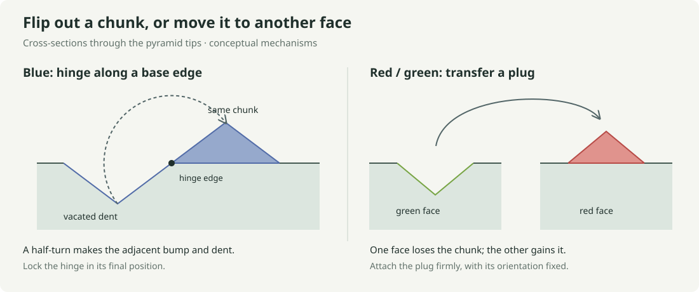

# Chair44: centered relief and a movable physical model

Centering the relief allows more local packing contacts, but the complete local
catalogue gives a stronger result than finite-patch evidence: **every full tiling
by the centered shape, using integer translations and proper cubic rotations,
satisfies the original arrow rules**. All additional neighboring pairs have
short, independently checked contradiction certificates. This result does not
establish that arbitrary physical placements must align to that lattice.

On the [live Chair44 page](https://liuyao12.github.io/geometric-tree-search/3d-reptiles/),
choose **Relief → Centered** to compare the shapes. This changes the displayed
geometry. Apply one and Run still use the original arrow search; the separate
research search below uses only relief occupancy.

## A physical flip-out construction



For **blue**, cut a small square pyramid from beneath the face, with one base
edge as the hinge. Turning that solid through a half-turn takes it outside the
face onto the adjacent footprint. The vacated pyramid is the dent; the moved
pyramid is the bump. This realizes the joined blue profile exactly in the ideal
zero-thickness hinge model. The two inward slopes remain coplanar.

For **red and green**, remove a pyramid plug from a green face and attach that
same plug, turned tip-out, to a red face. The current chair has equal numbers
and sizes of these plugs and recesses. This is a transfer between faces: a
solid piece flipped out locally cannot create only a bump without leaving
its original volume empty somewhere. A hollow shell with reversible pyramid
inserts is another construction to explore, but its attachment and inversion
mechanism would need a separate design.

The intended tile has all inserts fixed in their prescribed final positions.
Freely changing their states during tiling would define a different tile system.
Hinge clearance, retaining tabs, material thickness, and assembly access remain
prototype questions; the drawing is a mechanism concept, not a fabrication plan.
It is likely easiest to test the blue hinge on a single flat panel first.

These are our proposed mechanisms, not constructions specified by the paper.
Goodman–Strauss describes raising one side of blue while lowering the other,
and making complementary red/green features in
[Section 2](https://arxiv.org/html/2609.24779v1#S2).

## The centered variant

Only the forward offsets change. In the local coordinates used by the renderer,
$u$ is sideways along the panel and $v$ follows the arrow. The features are
square pyramids with base half-width $r$ and signed height $h$:

| Feature | Center $(u,v)$ | $r$ | $h$ |
|---|---|---|---|
| Red bump | $(0,0)$ | $0.24$ | $0.12$ |
| Green dent | $(0,0)$ | $0.24$ | $-0.12$ |
| Blue bump | $(0.16,0)$ | $0.16$ | $0.12$ |
| Blue dent | $(-0.16,0)$ | $0.16$ | $-0.12$ |

The original offsets were $v=0.10$ for red/green and $v=0.08$ for blue.
“Centered blue” means the midpoint of the pair is at the panel center, not that
both pyramids occupy the same footprint. The colors identify the features in
the display; the experimental solver never checks color or arrow agreement.

The centered red/green square pyramids have no preferred arrow direction.
The blue bump/dent pair still has a direction. Testing all facing configurations
confirms that red/green can now meet in all four panel rotations, while blue
still retains its original directional compatibility.

## Complete local exclusion result

Counts fix one chair at the origin in its original orientation. Placements use
all $24$ proper cubic rotations and integer translations, with no symmetry
reduction of the candidate list.

| Stage | Offset relief | Centered relief |
|---|---:|---:|
| Non-overlapping face-neighbor placements | $128$ | $316$ |
| Placements also accepted by the original arrows | $44$ | $44$ |
| Additional non-arrow pairs | $84$ | $272$ |
| Additional pairs rejected by the initial global frontier | $84$ | $270$ |
| Additional pairs rejected after one forced tile | $0$ | $2$ |
| Pairs remaining for larger extension tests | $30$ | $30$ |

In both models, another $14$ arrow-compatible pairs already have a dead point
elsewhere on their frontier. In the centered model, only $88$ of the additional
pairs have an immediate sealed gap between already occupied cells. The other
rejections require considering the surrounding geometry.

The two extra pairs surviving the initial frontier are `7@2,-1,1` and
`7@2,1,-1`, where each identifier gives a variant and translation. For each,
a frontier cell has exactly one possible covering tile. Placing that tile
leaves another frontier cell with no legal covering tile. There is no branch
choice and no budget-dependent conclusion in either exclusion.

Every one of the $272$ exclusions is stored as a chain of forced placements
ending at an uncovered point with an empty domain. The independent checker:

- Regenerates all $316$ geometrically non-overlapping neighbors in the complete
  possible translation box, independently of the search graph.
- For each certificate obligation, enumerates every possible covering tile
  using all orientations and cell alignments.
- Checks whole-candidate legality using cell occupancy and continuous relief
  interfaces, evaluated at every vertex of their piecewise-linear subdivision.
- Verifies that each forced domain is a singleton and each final domain is empty.

It checks $272$ contradictions and $2$ forced placements. This supports the
following restricted computational conclusion. Any full centered-relief tiling
in the declared lattice placement domain has a neighbor pair from the complete
catalogue at every contact. All non-arrow pairs are impossible in such a tiling.
Consequently it obeys every original arrow contact. Conversely, the centered
profiles fit at every original arrow contact, so every original arrow tiling is
also a centered-relief tiling. **The two systems have the same full tilings within
this placement domain.** This transfers the paper's hierarchical conclusion
within that domain; it does not reproduce the paper's proof or settle physical
alignment without the lattice assumption.

## Finite extension witnesses

The relief-only search also extends all $30$ surviving pairs through surrounding
cell-distance layers. These runs do not use inflation positions, hierarchy
recognition, arrow matching, or a prefiltered neighbor catalogue to guide moves.

| Cell layers | Witnesses | Tiles per patch | Seeds with a unique compatible parent | Seeds with a complete parent present |
|---|---:|---:|---:|---:|
| $1$ | $30$ | $13$–$73$ | $60/60$ | $49/60$ |
| $2$ | $30$ | $47$–$164$ | $60/60$ | $60/60$ |
| $3$ | $30$ | $70$–$177$ | $60/60$ | $60/60$ |

All $90$ patches pass independent rendered-profile replay, target coverage, and
frontier viability. The replay performs $573{,}370$ height comparisons. All
also satisfy the arrows when checked afterward. Parent recognition is solely a
post-search diagnostic; a finite witness is not an infinite extension proof.
Each extension has budgets of $1000$ nodes and $512$ tiles. None reached a budget.

## Point model and algorithm audit

The search uses only binary occupancy $t\in\{0,1\}$, with no marking values.
Its point domain contains all cell centers and $10$ probes per unit panel.
Relative to a panel center, in tangent axes and positive normal coordinates,
these probes have positions

$$
\left(\frac{\sqrt2\,x}{100},\frac{\sqrt2\,y}{100},\frac{h}{400}\right),
\qquad (x,y)\in\{(0,0),(\pm8,\pm8)\},\quad h\in\{-47,47\}.
$$

Point identifiers and height comparisons use exact integers; the represented
coordinates are in $\mathbb Q(\sqrt2)$. The point model is independently checked
against the actual profile and against exact geometric overlap and gap tests
at $117$ subdivision vertices, for all $864$ facing-panel configurations.
All $24$ rotations preserve the complete point support. Every modification
stays strictly inside a disjoint panel-centered $\ell^1$ ball of radius $1/2$,
so only the two adjacent cell owners can fill a panel gap.

The implementation retains the complete frontier/candidate bipartite graph,
global dead-point checks, global forced moves, and earliest-generation branching.
It fixes both seed tiles, uses immutable rollback, and distinguishes exhausted
search from budget stops. Complete graphs are rebuilt after moves rather than
updated incrementally; that remains the principal implementation gap against
[the master algorithm contract](../basic-tiling-algorithm.md). Target semantics
are the same cell-distance layers as the
[offset experiment](chair44-relief-search.md), not full tile coronas. These are
finite checkpoints, with no claim of a fair infinite growth implementation.

The certificate replay is a separately labeled geometric verifier, not an
additional predicate or learned filter inside the point-value search.

## Reproduction and data

```sh
node scripts/test-chair-relief-points.mjs
CHAIR_RELIEF_CENTERED=1 CHAIR_RELIEF_RADIUS=3 \
  CHAIR_RELIEF_NODES=1000 CHAIR_RELIEF_TILES=512 \
  node scripts/run-chair-relief-search.mjs
CHAIR_RELIEF_OUT=output/chair44-centered-relief-search \
  node scripts/verify-chair-relief-search.mjs
node scripts/certify-chair-centered-relief.mjs
```

- [Search results and hierarchy audits](../data/chair44-centered-relief/results.json)
- [All exclusion certificates](../data/chair44-centered-relief/exclusion-certificates.json)
- [Replay archive: results, certificates, and all 90 patches](../data/chair44-centered-relief/witnesses.zip)
- [Certificate generator and independent checker](../../scripts/certify-chair-centered-relief.mjs)
